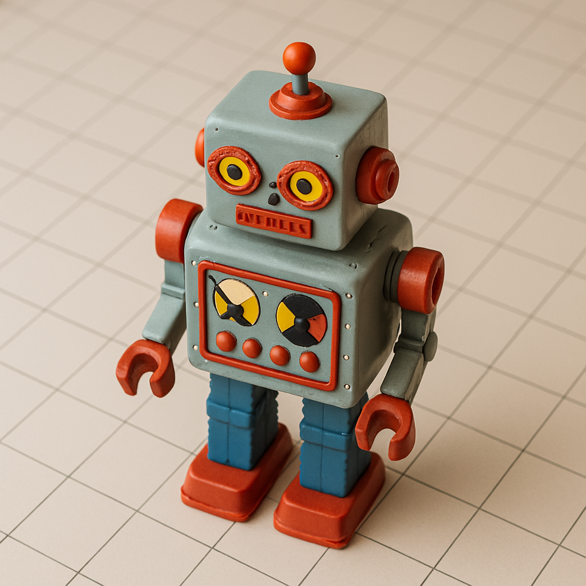

<!-- README.md -->
[](https://github.com/tantalusblank/roborover/actions)

# RoboRover
RoboRover is a simple simulation of a toy robot on a tabletop, taking commands from the user to interact with the robot.



# Requirements
## Nomenclature
- **Shall** requirements must be met for the application to be considered complete.

## Specification
1. The application **shall** take in commands and output an end state
2. Command input **shall** be from a file or from standard input
3. The tabletop in the application **shall** be square
4. The tabletop in the application **shall** have defined bounds of 5 units (x-axis) by 5 units (y-axis), where a unit is the movement distance of the robot in a single command
5. The `SOUTH` `WEST` corner shall be considered the origin (0,0) of the tabletop
6. The tabletop in the application **shall** have no obstructions except the robot
7. Commands that would result in the robot position being outside the tabletop bounds **shall** not be executed
8. The application **shall** be able to accept the following commands: `PLACE`, `MOVE`, `LEFT`, `RIGHT`, and `REPORT`
9. On starting the application, all commands **shall** not be executed until a valid `PLACE` command is issued
10. The `PLACE` command **shall** put the robot on the tabletop in position X,Y and facing `NORTH`, `SOUTH`, `EAST` or `WEST` when the command is issued in the format `PLACE X,Y,F`
11. The `MOVE` command **shall** move the toy robot one unit forward in the direction it is currently facing
12. The `LEFT` and `RIGHT` commands **shall** rotate the robot 90 degrees in the specified direction without
changing the position of the robot
13. The `REPORT` command **shall** announce the X, Y position of the robot, and the direction it is facing. This can be in any form, but standard
output is sufficient. 


# To Run
Install uv version `0.6.14` by following the [installation instructions](https://docs.astral.sh/uv/getting-started/installation/).

Clone the repo, navigate to the terminal path, then run the following command in the terminal:

```bash
uv run roborover.py
```

# Architecture
RoboRover uses the [Command Pattern](https://en.wikipedia.org/wiki/Command_pattern/) to separate command logic from the robot logic. This allows for easy extensibility of commands and testing of commands in isolation.